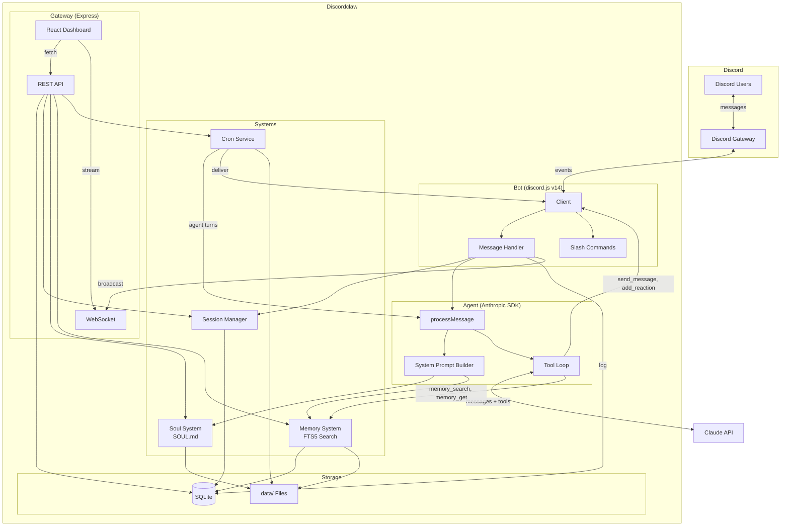
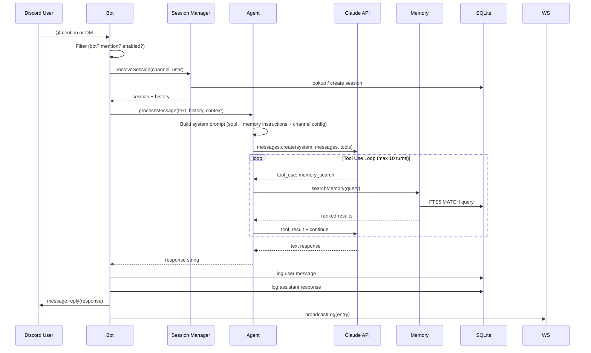
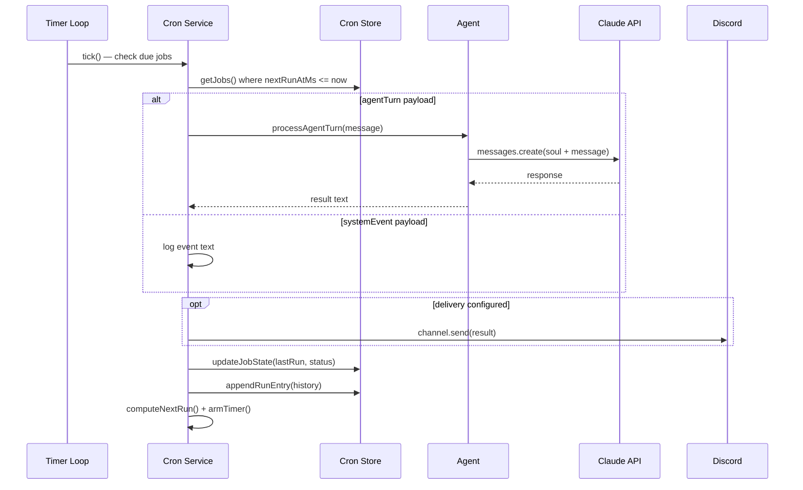
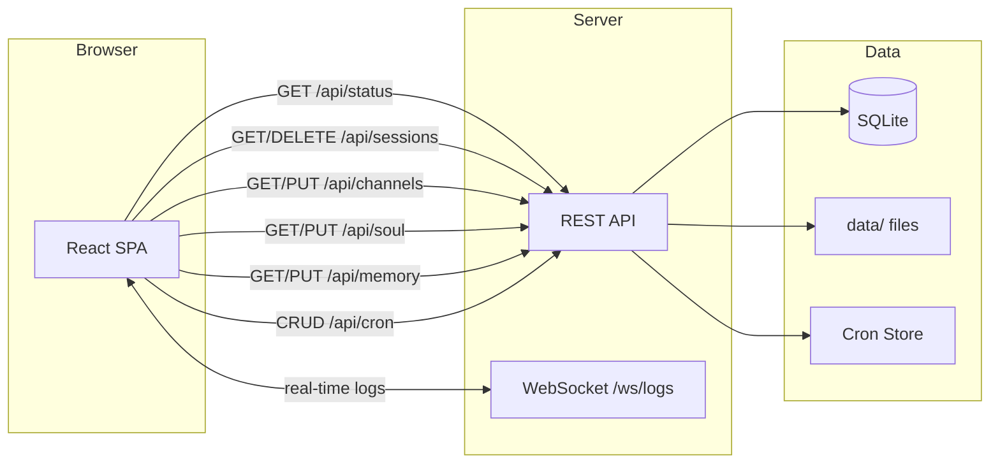

# Discordclaw

A stripped-down Discord agent powered by Claude. Simplified fork of [openclaw](https://github.com/openclaw/openclaw) — keeps only Discord, replaces multi-provider AI with Anthropic SDK, adds a web dashboard.

## Architecture



## Data Flow

### Message Flow



### Cron Job Execution



### Dashboard Data Flow



## Project Structure

```
discordclaw/
├── src/
│   ├── index.ts              # Entry point: start all systems
│   ├── bot/                   # Discord bot (discord.js v14)
│   │   ├── client.ts          # Client setup, intents, event routing
│   │   ├── messages.ts        # Message pipeline: filter → session → agent → reply
│   │   ├── commands.ts        # Slash commands: /help /config /sessions /forget /soul
│   │   └── components.ts      # Button/select interaction handler
│   ├── agent/                 # Claude integration
│   │   ├── agent.ts           # Anthropic SDK wrapper, system prompt, tool loop
│   │   ├── tools.ts           # Discord tools (send_message, add_reaction, get_history)
│   │   └── sessions.ts        # Per-thread/DM session tracking + TTL
│   ├── soul/
│   │   └── soul.ts            # Load SOUL.md, file watcher, hot-reload
│   ├── memory/
│   │   ├── memory.ts          # File discovery, FTS5 indexing, BM25 search
│   │   └── tools.ts           # memory_search + memory_get tool definitions
│   ├── cron/
│   │   ├── types.ts           # Job, schedule, payload, delivery types
│   │   ├── store.ts           # JSON persistence + JSONL run history
│   │   └── service.ts         # Timer loop, execution, retry, auto-disable
│   ├── db/
│   │   └── index.ts           # SQLite schema, migrations, query helpers
│   └── gateway/
│       ├── server.ts          # Express + WebSocket server
│       ├── api.ts             # REST API (status, sessions, channels, config, soul, memory, cron)
│       └── ui/                # React SPA (Vite)
│           ├── App.tsx         # Layout, routing, shared styles
│           └── pages/          # Status, Sessions, Channels, Config, Cron, Logs
├── data/                      # Runtime data (gitignored)
│   ├── discordclaw.db         # SQLite database
│   ├── SOUL.md                # Bot personality
│   ├── MEMORY.md              # Long-term memory
│   ├── memory/                # Daily memory notes
│   └── cron/                  # Job store + run history
├── .env                       # DISCORD_BOT_TOKEN, ANTHROPIC_* config
├── package.json
├── tsconfig.json
└── vite.config.ts
```

## Setup

### Discord Bot

1. Go to https://discord.com/developers/applications
2. Create a new application, then go to **Bot** tab
3. Copy the bot token for your `.env`
4. Under **Privileged Gateway Intents**, enable:
   - **Message Content Intent** (required)
   - **Server Members Intent** (recommended)
5. Go to **OAuth2 > URL Generator**, select scopes: `bot`, `applications.commands`
6. Select permissions: Send Messages, Read Message History, Add Reactions, Use Slash Commands
7. Use the generated URL to invite the bot to your server

### Install & Run

```bash
# Install
npm install

# Configure
cp .env.example .env
# Edit .env with your Discord bot token and Anthropic API config

# Build dashboard
npm run build:ui

# Run
npm run dev
```

The bot responds to **@mentions** in guild channels and all **DMs**. Dashboard available at `http://localhost:3000`.

## Environment Variables

| Variable | Required | Description |
|----------|----------|-------------|
| `DISCORD_BOT_TOKEN` | Yes | Discord bot token |
| `ANTHROPIC_API_KEY` | Yes* | Anthropic API key |
| `ANTHROPIC_BASE_URL` | No | Proxy URL (overrides default API endpoint) |
| `ANTHROPIC_AUTH_TOKEN` | No | Auth token for proxy (used instead of API key) |
| `ANTHROPIC_MODEL` | No | Model name (default: `bedrock-claude-opus-4-6-1m`) |
| `GATEWAY_PORT` | No | Dashboard port (default: `3000`) |
| `SESSION_TTL_HOURS` | No | Session expiry (default: `24`) |

*Either `ANTHROPIC_API_KEY` or `ANTHROPIC_BASE_URL` + `ANTHROPIC_AUTH_TOKEN` required.

## Key Systems

**Soul** — Bot personality defined in `data/SOUL.md`. Hot-reloads on file change. Editable via dashboard.

**Memory** — Markdown files in `data/` indexed with SQLite FTS5. The agent searches memory before answering questions about past context. BM25 ranked results.

**Sessions** — Per-thread/DM/channel conversation tracking. History loaded as context for each message. Auto-expires after TTL.

**Cron** — Scheduled tasks with three schedule types: one-shot (`at`), interval (`every`), cron expression (`cron`). Jobs can run agent turns and deliver results to Discord channels. Auto-disables after 3 consecutive failures.

**Dashboard** — Single-page React app at `http://localhost:3000`. Status, session browser, channel config, soul/memory editor, cron manager, real-time message logs via WebSocket.
