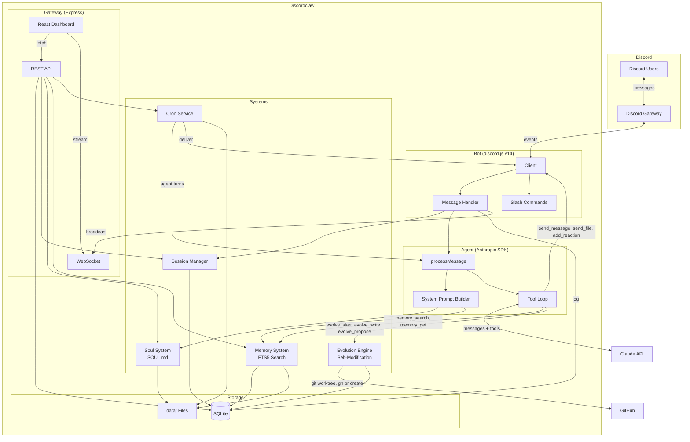
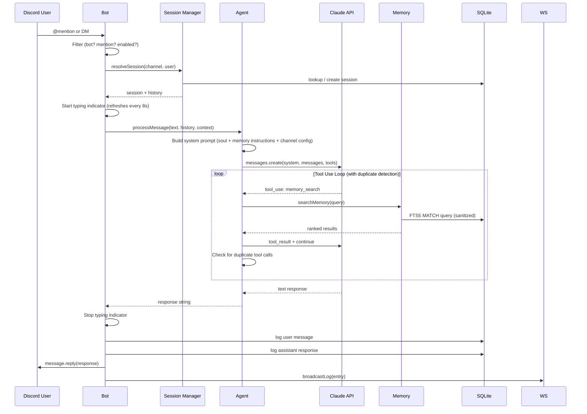
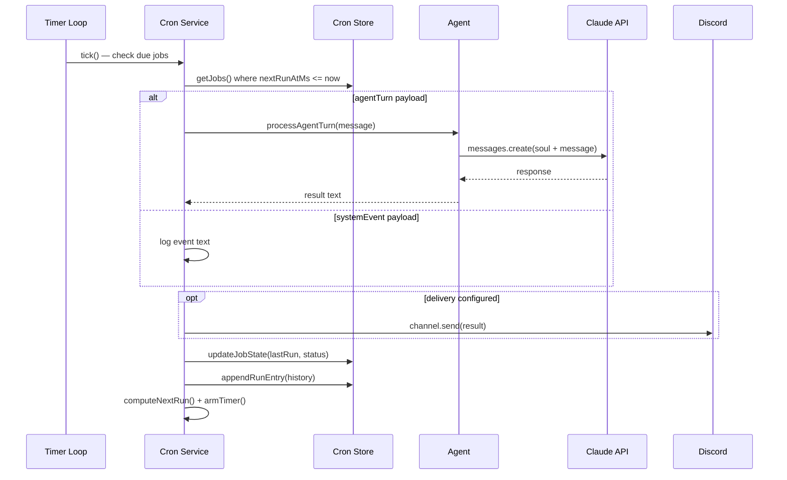
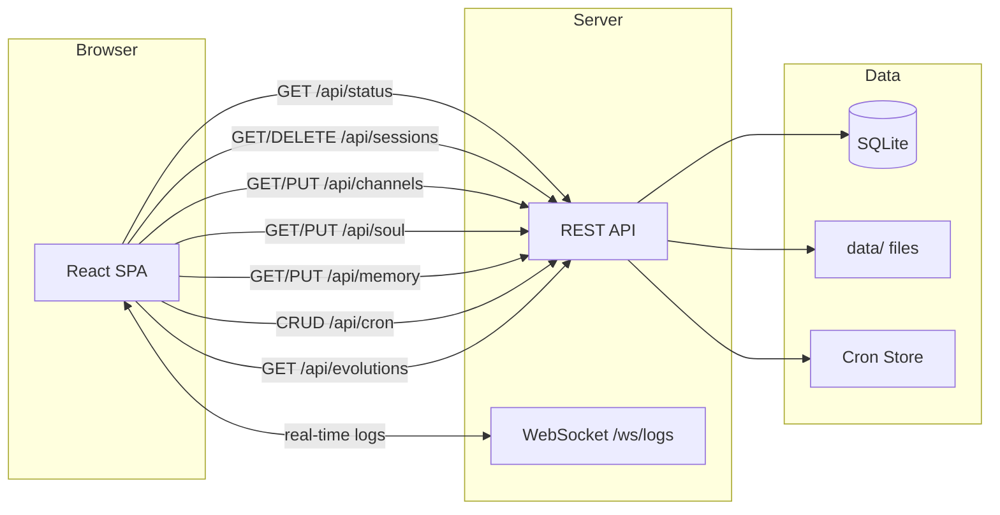
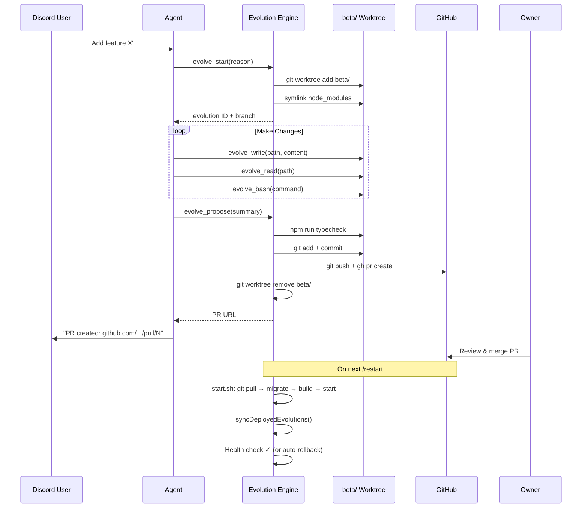

# Discordclaw

A stripped-down Discord agent powered by Claude. Simplified fork of [openclaw](https://github.com/openclaw/openclaw) — keeps only Discord, replaces multi-provider AI with Anthropic SDK, adds a web dashboard.

## Architecture



## Data Flow

### Message Flow



### Cron Job Execution



### Dashboard Data Flow



### Evolution Flow



## Project Structure

```
discordclaw/
├── src/
│   ├── index.ts              # Entry point: start all systems, kill stale instances on restart
│   ├── restart.ts            # Shared restart trigger — avoids circular deps
│   ├── bot/                   # Discord bot (discord.js v14)
│   │   ├── client.ts          # Client setup, intents, event routing, DM raw fallback
│   │   ├── messages.ts        # Message pipeline: filter → session → agent → reply (persistent typing)
│   │   ├── commands.ts        # Slash commands: /help /config /sessions /clear /soul
│   │   └── components.ts      # Button/select interaction handler
│   ├── agent/                 # Claude integration
│   │   ├── agent.ts           # Anthropic SDK wrapper, system prompt, tool loop + duplicate detection
│   │   ├── tools.ts           # Discord tools (send_message, send_file, add_reaction, get_history)
│   │   ├── dangerous-tools.ts # Powerful tools: bash, read_file, write_file
│   │   └── sessions.ts        # Per-thread/DM session tracking + TTL
│   ├── skills/                # Skills management (SDK pattern)
│   │   ├── types.ts           # Skill, SkillMeta, SkillSource types
│   │   ├── store.ts           # File persistence + metadata JSON
│   │   ├── service.ts         # CRUD, GitHub install, prompt generation, file watcher
│   │   └── tools.ts           # read_skill + list_skill_files tool definitions
│   ├── soul/
│   │   └── soul.ts            # Load SOUL.md, file watcher, hot-reload
│   ├── memory/
│   │   ├── memory.ts          # File discovery, FTS5 indexing, BM25 search, query sanitization
│   │   └── tools.ts           # memory_search + memory_get tool definitions
│   ├── cron/
│   │   ├── types.ts           # Job, schedule, payload, delivery types
│   │   ├── store.ts           # JSON persistence + JSONL run history
│   │   └── service.ts         # Timer loop, execution, retry, auto-disable
│   ├── evolution/             # Self-evolution system
│   │   ├── engine.ts          # Git worktree lifecycle, PR creation via gh CLI
│   │   ├── log.ts             # Evolution SQLite table + CRUD
│   │   ├── tools.ts           # Agent tools: evolve_start/read/write/bash/propose/suggest/cancel
│   │   └── health.ts          # /api/health endpoint for start.sh
│   ├── db/
│   │   └── index.ts           # SQLite schema, migrations, query helpers
│   └── gateway/
│       ├── server.ts          # Express + WebSocket server
│       ├── api.ts             # REST API (status, sessions, channels, config, soul, memory, cron, skills, evolutions)
│       └── ui/                # React SPA (Vite)
│           ├── App.tsx         # Layout, routing, shared styles
│           └── pages/          # Status, Sessions, Channels, Config, Cron, Skills, Evolution, Logs
├── data/                      # Runtime data (gitignored)
│   ├── discordclaw.db         # SQLite database
│   ├── SOUL.md                # Bot personality
│   ├── MEMORY.md              # Long-term memory
│   ├── memory/                # Daily memory notes
│   ├── cron/                  # Job store + run history
│   ├── skills/                # Installed skills (SKILL.md + companion files)
│   └── .migrations/           # Marker files for completed migrations
├── migrations/                # Idempotent migration scripts (run by start.sh)
├── start.sh                   # Production startup: pull → migrate → build → start → health check
├── .env                       # DISCORD_BOT_TOKEN, ANTHROPIC_* config
├── package.json
├── tsconfig.json
└── vite.config.ts
```

## Setup

### Discord Bot

1. Go to https://discord.com/developers/applications
2. Create a new application, then go to **Bot** tab
3. Copy the bot token for your `.env`
4. Under **Privileged Gateway Intents**, enable:
   - **Message Content Intent** (required)
   - **Server Members Intent** (recommended)
5. Go to **OAuth2 > URL Generator**, select scopes: `bot`, `applications.commands`
6. Select permissions: Send Messages, Read Message History, Add Reactions, Attach Files, Use Slash Commands
7. Use the generated URL to invite the bot to your server

### Install & Run

```bash
# Install
npm install

# Configure
cp .env.example .env
# Edit .env with your Discord bot token and Anthropic API config

# Build dashboard
npm run build:ui

# Development
npm run dev

# Production (with auto-pull, migrations, health check, rollback)
./start.sh
```

The bot responds to **@mentions** in guild channels and all **DMs**. Dashboard available at `http://localhost:3000`.

## Environment Variables

| Variable | Required | Description |
|----------|----------|-------------|
| `DISCORD_BOT_TOKEN` | Yes | Discord bot token |
| `ANTHROPIC_API_KEY` | Yes* | Anthropic API key |
| `ANTHROPIC_BASE_URL` | No | Proxy URL (overrides default API endpoint) |
| `ANTHROPIC_AUTH_TOKEN` | No | Auth token for proxy (used instead of API key) |
| `ANTHROPIC_MODEL` | No | Model name (default: `bedrock-claude-opus-4-6-1m`) |
| `GATEWAY_PORT` | No | Dashboard port (default: `3000`) |
| `SESSION_TTL_HOURS` | No | Session expiry (default: `24`) |
| `DISCORD_WEBHOOK_URL` | No | Webhook for `start.sh` notifications (deploy, rollback alerts) |

*Either `ANTHROPIC_API_KEY` or `ANTHROPIC_BASE_URL` + `ANTHROPIC_AUTH_TOKEN` required.

## Key Systems

**Soul** — Bot personality defined in `data/SOUL.md`. Hot-reloads on file change. Editable via dashboard.

**Memory** — Markdown files in `data/` indexed with SQLite FTS5. The agent searches memory before answering questions about past context. BM25 ranked results. Queries are sanitized for FTS5 compatibility (special characters like hyphens and colons are handled automatically).

**Sessions** — Per-thread/DM/channel conversation tracking. History loaded as context for each message. Auto-expires after TTL.

**Cron** — Scheduled tasks with three schedule types: one-shot (`at`), interval (`every`), cron expression (`cron`). Jobs can run agent turns and deliver results to Discord channels. Auto-disables after 3 consecutive failures.

**Skills** — Modular capabilities defined as SKILL.md files with YAML frontmatter. Install from GitHub URL or upload directly. Uses SDK progressive loading pattern: only skill metadata (name, description, path) is injected into the system prompt; the agent reads full skill content on demand via `read_skill` tool. Skills can include companion files (scripts, references). Manageable via dashboard.

**Dashboard** — Single-page React app at `http://localhost:3000`. Status, session browser, channel config, soul/memory editor, cron manager, skills manager, evolution history, real-time message logs via WebSocket.

**Agent Loop** — The tool-use loop runs until the model produces a final text response. To prevent infinite loops, consecutive duplicate tool calls (same tool + same arguments) are detected — after 2 identical rounds the agent is forced to produce a final response. Typing indicator refreshes every 8 seconds to stay visible during long tool chains.

**File Attachments** — The agent can send files (PDFs, images, HTML, etc.) to Discord channels via the `send_file` tool. Files up to 25 MB are supported (Discord bot default tier).

**Evolution Engine** — The bot can modify its own source code through GitHub pull requests. All changes are isolated in a git worktree at `beta/`, typechecked, and submitted as PRs via `gh` CLI. The agent has 7 evolution tools: `evolve_start`, `evolve_read`, `evolve_write`, `evolve_bash`, `evolve_propose`, `evolve_suggest`, and `evolve_cancel`. The bot also records ideas for improvements it can't yet make (`evolve_suggest`). Evolution history is tracked in SQLite and viewable in the dashboard. An idempotent startup script (`start.sh`) handles deploy: `git pull` → run migrations → build → start → health check → auto-rollback on failure.

**Restart** — The bot can restart itself via slash command. On restart, stale instances are automatically detected and killed to prevent duplicate bots.
