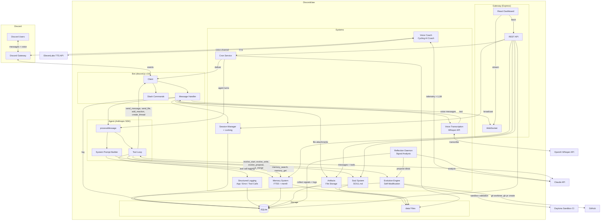
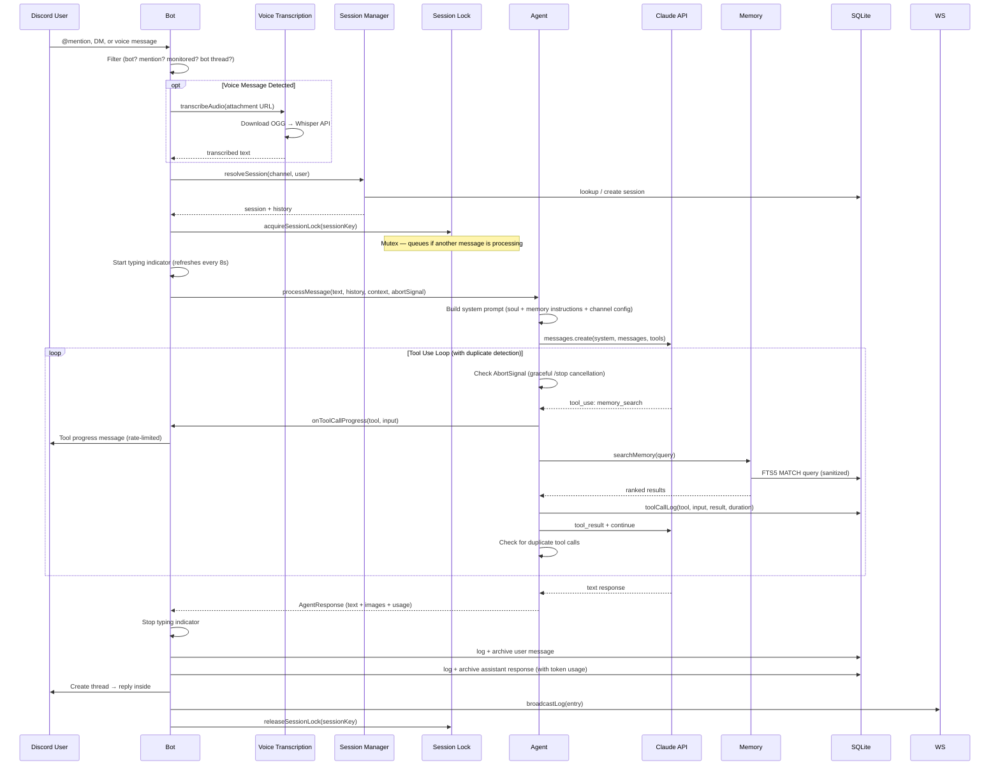
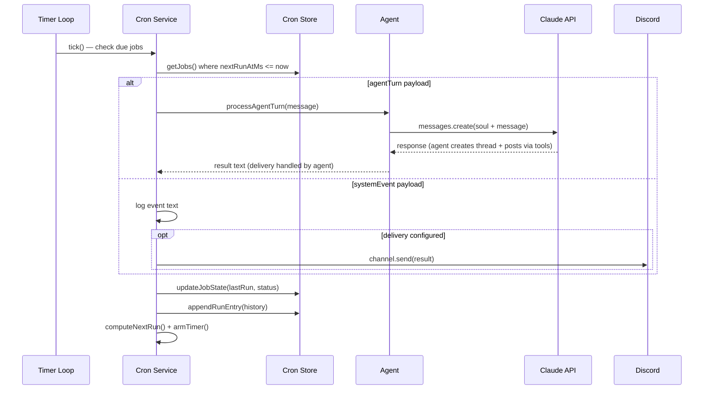
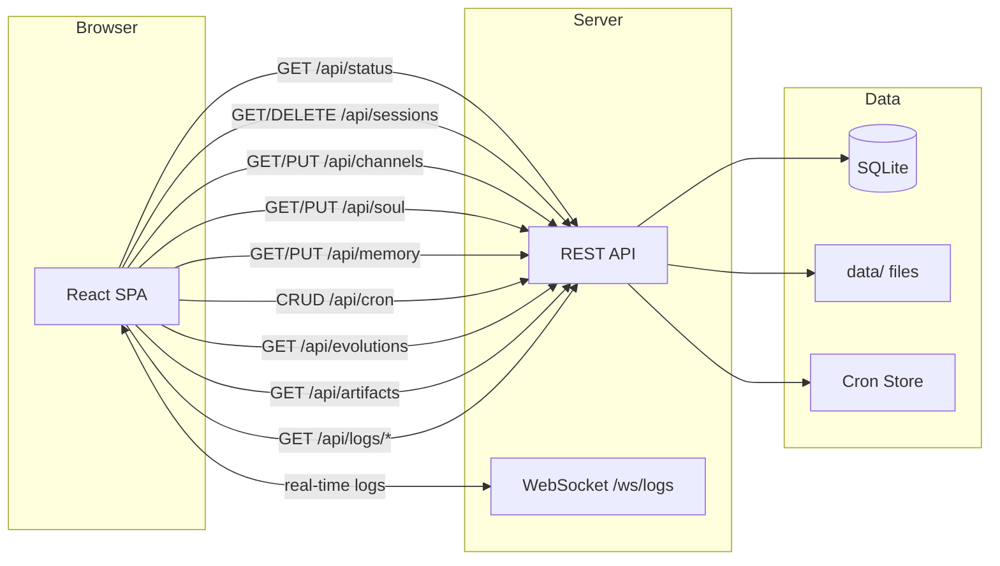
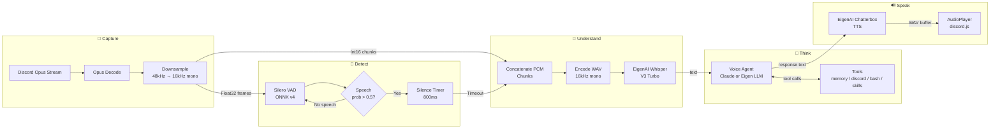
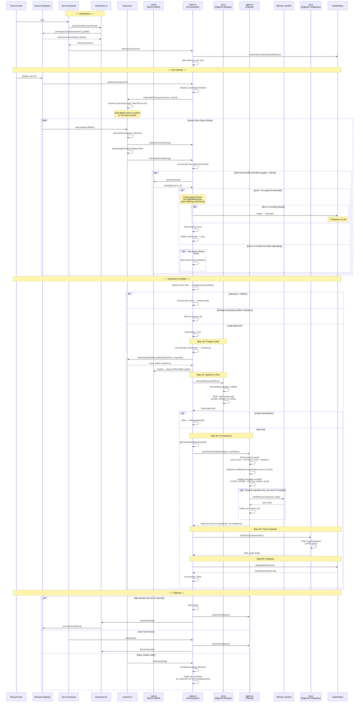
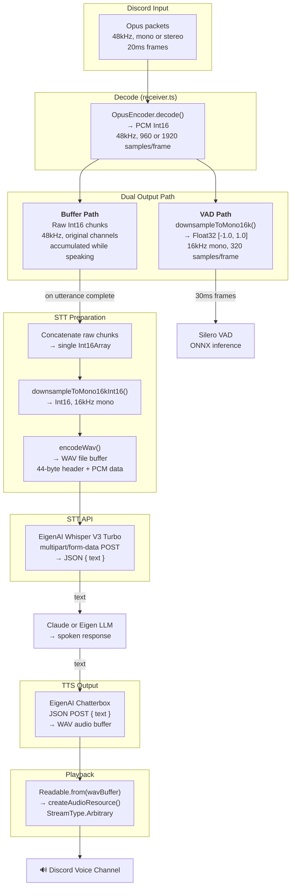
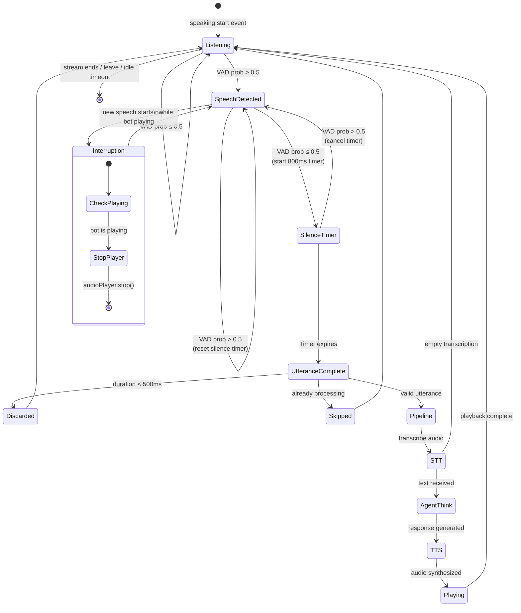
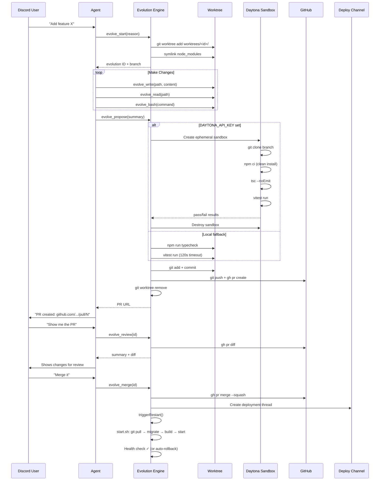

<p align="center">
  
</p>

# Discordclaw

A stripped-down Discord agent powered by Claude. Simplified fork of [openclaw](https://github.com/openclaw/openclaw) — keeps only Discord, replaces multi-provider AI with Anthropic SDK, adds a web dashboard.

## Features

- 💬 **Conversational AI** — @mention in channels or DM directly. Full conversation history per session.
- 🧵 **Thread-First Replies** — In guild channels, every response goes into its own thread for clean session isolation. Monitored channels auto-respond without @mention.
- 🎤 **Voice Message Support** — Send voice DMs and the bot transcribes them automatically via OpenAI Whisper.
- 🎙️ **Voice Assistant** — Join voice channels with `/join`. Listens via Silero VAD, transcribes with EigenAI Whisper, thinks with Claude (or Eigen LLM), speaks back with EigenAI Chatterbox TTS. Supports interruptions, streaming TTS pipelining, and auto-disconnect. Auto-join mode tracks a configured user.
- 🚴 **Voice Coach** — AI cycling coach that lives in a dedicated voice channel. Auto-joins when a tracked rider connects, monitors simulated cycling telemetry (power, heart rate, cadence), listens to rider speech via VAD+STT, and delivers real-time coaching via ElevenLabs TTS — all in the persona of a team sport director on race radio. Requires `ELEVENLABS_API_KEY`.
- 📎 **Artifacts** — Persistent file storage for session inputs and outputs. Files uploaded to or generated by the agent are tracked with metadata, stored on disk, and browsable via the dashboard Artifacts page. Supports input/output tagging, Discord URL linking, and per-session browsing.
- 🧠 **Persistent Memory** — Remembers things across conversations. Markdown files indexed with FTS5 full-text search. Optional mem9 cloud memory for semantic vector search.
- 📜 **Conversation History** — Messages are archived across sessions. Query past conversations with `get_conversation_history` and `get_conversation_stats` tools.
- 🎭 **Customizable Personality** — Edit `SOUL.md` to change how the bot behaves. Hot-reloads on save.
- 🔧 **Tool Use** — Runs shell commands, reads/writes files, sends messages across channels, reacts to messages, attaches files, creates threads. Real-time tool call progress shown in Discord during agentic loops.
- 🔒 **Session Locking** — Per-session mutex prevents interleaved responses. `/stop` command aborts all active processing with graceful cancellation.
- 📦 **Skills** — Drop a `SKILL.md` folder into `data/skills/` and the bot learns new capabilities instantly. Install from GitHub or upload directly.
- ⏰ **Scheduled Tasks** — Cron jobs that run agent turns on a schedule, delivering results in daily threads. Hot-reloads `jobs.json` without restart.
- 🧬 **Self-Evolution** — The bot can modify its own source code via GitHub PRs. Review diffs and merge from Discord. Optional Daytona sandbox CI for isolated validation. Deployment notifications posted automatically.
- 🔍 **Autonomous Reflection** — Collects signals (errors, tool failures, duplicate loops) and structured logs, then periodically analyzes them to suggest improvements.
- 📊 **Web Dashboard** — React SPA for managing sessions, channels, soul, memory, cron, skills, artifacts, evolution history, and logs.
- 📝 **Structured Logging** — Three SQLite-backed log streams (application, error, tool calls) with dashboard viewer and automatic pruning.
- 🔍 **Web Search** — Install the SearXNG skill for web, news, and package repository search.

## Demo User Flow

```
You: Hey @Discordclaw, what did we talk about yesterday?
Bot: [searches memory] We discussed setting up the cron job
     for daily standups. Want me to finish that?

You: Yeah, set it up for 9am every weekday in #general
Bot: [creates cron job] Done! I'll post a standup prompt
     to #general at 9am Mon-Fri. ✅

You: 🎤 [sends voice message]
Bot: [transcribes audio] I heard you say "Can you search
     for the latest Node.js release?" Let me check...
     Node.js v22.5.0 was released on April 1, 2026.

You: Can you search the web for the latest Node.js release?
Bot: [reads searxng-search skill, runs search] Node.js v22.5.0
     was released on April 1, 2026 with...

You: I want you to add a /ping command that shows latency
Bot: [evolve_start → evolve_write → evolve_propose]
     PR created: github.com/.../pull/8
     Want me to show you the diff?

You: Looks good, merge it
Bot: [evolve_merge] Merged and restarting... ✅
     /ping command is now live!
```

### Slash Commands

| Command | Description |
|---------|-------------|
| `/ping` | Show bot health status, latency, and uptime |
| `/help` | Show all commands and capabilities |
| `/config` | Toggle bot on/off per channel, set custom instructions |
| `/clear` | Reset conversation history in current session |
| `/soul` | View the bot's personality |
| `/skills` | List, install (from GitHub or file upload), or remove skills |
| `/cron` | View, add, enable/disable, force-run, or show history of cron jobs |
| `/restart` | Restart the bot process |
| `/stop` | Abort all active processing sessions (graceful cancellation via AbortSignal) |
| `/join` | Join your voice channel as a voice assistant |
| `/leave` | Leave the voice channel |

## Getting Started

Each instance of Discordclaw is its own bot with its own personality, memory, and evolution history. To run your own, you'll **fork the repo** and deploy from your fork. This way the self-evolution feature creates PRs against *your* repo, not the upstream one.

### Prerequisites

- **Node.js** v20+
- **Git** and **GitHub CLI** (`gh`) — required for the self-evolution engine
- A **Discord bot token** ([setup guide below](#1-create-a-discord-bot))
- An **Anthropic API key** (or a proxy endpoint)
- *(Optional)* An **OpenAI API key** for voice message transcription
- *(Optional)* An **EigenAI API key** for voice assistant STT/TTS
- *(Optional)* An **ElevenLabs API key** for voice coach TTS
- *(Optional)* A **Daytona API key** for sandbox CI during evolution validation

### 1. Fork & Clone

1. Click **Fork** on [the repo](https://github.com/NaichuanZhang/discord-claw) to create your own copy
2. Clone your fork:

```bash
git clone https://github.com/YOUR_USERNAME/discord-claw.git
cd discord-claw
```

> **Why fork?** The evolution engine pushes branches and creates PRs via `gh`. If you clone without forking, PRs would target the original repo. Your fork gives you full control — the bot evolves *your* codebase.

### 2. Create a Discord Bot

1. Go to https://discord.com/developers/applications
2. Create a new application → **Bot** tab → copy token
3. Enable **Message Content Intent** and **Server Members Intent**
4. **OAuth2 > URL Generator** → scopes: `bot`, `applications.commands`
5. Permissions: Send Messages, Read Message History, Add Reactions, Attach Files, Use Slash Commands, Create Public Threads
6. Invite bot to your server with the generated URL

### 3. Configure Environment

```bash
cp .env.example .env
```

Edit `.env` with your tokens:

```env
DISCORD_BOT_TOKEN=your_discord_bot_token
ANTHROPIC_API_KEY=your_anthropic_api_key

# Optional
OPENAI_API_KEY=your_openai_key          # Voice message transcription
EIGENAI_API_KEY=your_eigenai_key        # Voice assistant STT/TTS
ELEVENLABS_API_KEY=your_elevenlabs_key  # Voice coach TTS
ELEVENLABS_VOICE_ID=your_voice_id       # Voice coach voice
GATEWAY_PORT=3000                        # Dashboard port
GATEWAY_TOKEN=your_secret_token          # Dashboard auth token
ANTHROPIC_MODEL=bedrock-claude-opus-4-7-1m # Model override (this is the default)
DAYTONA_API_KEY=your_daytona_key        # Sandbox CI for evolution validation
```

### 4. Install & Run

```bash
npm install
npm run build:ui    # Build the dashboard
npm run dev         # Start in development mode
```

The bot responds to **@mentions** in guild channels and all **DMs**. Dashboard at `http://localhost:3000`.

### 5. Production Deployment

For production, use the startup script which handles auto-pull, migrations, health checks, and rollback:

```bash
./start.sh
```

Or use the watchdog daemon for crash recovery and auto-restart:

```bash
npm run daemon
```

You can set up a systemd service, Docker container, or any process manager to keep it running. Point it at `start.sh` or the daemon as the entry point.

> **Tip:** Set `DISCORD_WEBHOOK_URL` in `.env` to receive deploy/rollback notifications in a Discord channel.

### 6. Authenticate GitHub CLI (for Self-Evolution)

The evolution engine uses `gh` to create and merge PRs. Make sure it's authenticated:

```bash
gh auth login
```

Without this, the bot can still function normally — it just won't be able to create PRs to modify its own code.

### 7. Make It Yours

- **Personality** — Edit `data/SOUL.md` to define how your bot talks and behaves. Hot-reloads on save.
- **Skills** — Drop skill folders into `data/skills/` or install from GitHub via the dashboard or `/skills add-github`.
- **Memory** — The bot builds memory over time. You can also seed `data/MEMORY.md` with initial context.

### Staying Up to Date

To pull improvements from the upstream repo into your fork:

```bash
git remote add upstream https://github.com/NaichuanZhang/discord-claw.git
git fetch upstream
git merge upstream/main
```

## Environment Variables

| Variable | Required | Description |
|----------|----------|-------------|
| `DISCORD_BOT_TOKEN` | Yes | Discord bot token |
| `ANTHROPIC_API_KEY` | Yes* | Anthropic API key |
| `ANTHROPIC_BASE_URL` | No | Proxy URL (overrides default API endpoint) |
| `ANTHROPIC_AUTH_TOKEN` | No | Auth token for proxy (used instead of API key) |
| `ANTHROPIC_MODEL` | No | Model name (default: `bedrock-claude-opus-4-7-1m`) |
| `OPENAI_API_KEY` | No | OpenAI API key for voice message transcription (Whisper) |
| `EIGENAI_API_KEY` | No | EigenAI API key for voice assistant STT (Whisper) and TTS (Chatterbox) |
| `ELEVENLABS_API_KEY` | No | ElevenLabs API key for voice coach TTS |
| `ELEVENLABS_VOICE_ID` | No | ElevenLabs voice ID for voice coach |
| `COACH_MODEL` | No | LLM model for voice coach brain (default: `bedrock-claude-sonnet-4-1m`) |
| `GATEWAY_PORT` | No | Dashboard port (default: `3000`) |
| `GATEWAY_TOKEN` | No | Auth token for dashboard API access |
| `GATEWAY_PUBLIC_URL` | No | Public URL for the gateway (used for artifact download links) |
| `SESSION_TTL_HOURS` | No | Session expiry (default: `24`) |
| `DISCORD_WEBHOOK_URL` | No | Webhook for `start.sh` notifications (deploy, rollback alerts) |
| `DAYTONA_API_KEY` | No | Daytona API key for sandbox CI during evolution validation (falls back to local if not set) |
| `DAYTONA_API_URL` | No | Daytona API endpoint (default: `https://app.daytona.io/api`) |
| `REFLECTION_CHANNEL_ID` | No | Discord channel for reflection daemon proposals |
| `REFLECTION_INTERVAL_HOURS` | No | How often the reflection daemon runs (default: `6`) |
| `REFLECTION_LOOKBACK_HOURS` | No | Signal lookback window (default: `24`) |
| `REFLECTION_MIN_SIGNALS` | No | Minimum signals before reflection triggers (default: `3`) |
| `REFLECTION_MODEL` | No | Claude model for reflection analysis (default: same as `ANTHROPIC_MODEL`) |
| `VOICE_MODEL` | No | Claude model for voice responses (default: `claude-sonnet-4-20250514`). Supports `eigen:<model>` prefix for Eigen LLM backend. |
| `VOICE_SILENCE_MS` | No | Silence duration to end utterance (default: `800`) |
| `VOICE_MIN_UTTERANCE_MS` | No | Minimum utterance length, skip noise (default: `500`) |
| `VOICE_MAX_TOKENS` | No | Max tokens for voice responses (default: `512`) |
| `VOICE_DEBUG` | No | Voice debug logging (default: on, set `0` to disable) |
| `VOICE_TTS_STREAM` | No | Streaming TTS for lower TTFB (default: on, set `0` to disable) |
| `VOICE_TOOLS_MODE` | No | Voice agent tools: `full` (all tools except evolution) or `minimal` (memory + conversation history only). Default: `full` |
| `VOICE_REFERENCE_FILE` | No | Path to reference audio file for TTS voice cloning (default: `data/voice-reference.mp3`) |

*Either `ANTHROPIC_API_KEY` or `ANTHROPIC_BASE_URL` + `ANTHROPIC_AUTH_TOKEN` required.

## Key Systems

**Soul** — Bot personality defined in `data/SOUL.md`. Hot-reloads on file change. Editable via dashboard.

**Memory** — Hybrid search system. Local markdown files in `data/` indexed with SQLite FTS5 (BM25-ranked), plus optional mem9 cloud memory for semantic vector search. Both sources are queried in parallel on every `memory_search` call. Queries are sanitized for FTS5 compatibility (special characters like hyphens and colons are handled automatically).

**Sessions** — Per-thread/DM/channel conversation tracking. History loaded as context for each message. Auto-expires after TTL. Messages are archived to enable cross-session querying via `get_conversation_history` and `get_conversation_stats` tools. Per-session mutex locking (`agent/session-lock.ts`) ensures only one message is processed at a time per session — queued messages wait until the lock is released. An `AbortSignal` is threaded through the agent loop, enabling graceful cancellation via the `/stop` command.

**Cron** — Scheduled tasks with three schedule types: one-shot (`at`), interval (`every`), cron expression (`cron`). `agentTurn` jobs run the agent and deliver results inside daily threads (the agent handles all delivery via tools — no duplicate top-level messages). `systemEvent` jobs deliver results directly to the configured channel. Auto-disables after 3 consecutive failures. Hot-reloads `jobs.json` on each tick cycle (up to every 60s) so externally-added jobs are picked up without a restart.

**Skills** — Modular capabilities defined as SKILL.md files with YAML frontmatter. Install from GitHub URL or upload directly. Uses SDK progressive loading pattern: only skill metadata (name, description, path) is injected into the system prompt; the agent reads full skill content on demand via `read_skill` tool. Skills can include companion files (scripts, references). Manageable via dashboard and `/skills` command.

**Dashboard** — Single-page React app at `http://localhost:3000`. Pages: Status, Sessions, Channels, Config, Cron, Skills, Artifacts, Evolution, Logs. Real-time message streaming via WebSocket.

**Agent Loop** — The tool-use loop runs until the model produces a final text response. To prevent infinite loops, consecutive duplicate tool calls (same tool + same arguments) are detected — after 2 identical rounds the agent is forced to produce a final response. Typing indicator refreshes every 8 seconds to stay visible during long tool chains. An `onToolCallProgress` callback fires for each tool invocation, sending real-time status messages to Discord (rate-limited to max 4 per 5s window).

**Thread-First Replies** — In guild text channels, every bot response creates a thread on the user's message. Bot-created threads don't require @mentions for follow-up. Monitored channels auto-respond to all messages without @mention. DMs bypass threading entirely.

**File Attachments** — The agent can send files (PDFs, images, HTML, etc.) to Discord channels via the `send_file` tool. Files up to 25 MB are supported (Discord bot default tier).

**Image Support** — When the agent's response contains markdown images (``), they are automatically extracted and rendered as Discord embeds (for web URLs) or file attachments (for local files). Image markdown is stripped from the text to avoid showing raw URLs.

**Voice Messages** — Discord voice DMs and audio attachments are automatically detected and transcribed using OpenAI's Whisper API. The transcribed text is passed to the agent as the message content. Requires `OPENAI_API_KEY`. Gracefully degrades with a helpful message if the API key isn't configured. Supports OGG, MP3, WAV, M4A, WebM, FLAC, and other common audio formats.

**Voice Assistant** — Real-time voice interaction in Discord voice channels. Pipeline: user speaks → opus decode → downsample to 16kHz mono → Silero VAD (ONNX, ~2MB model) detects speech boundaries → EigenAI Whisper V3 Turbo transcribes → LLM generates concise spoken response (1-3 sentences, no markdown) → EigenAI Chatterbox TTS synthesizes audio → bot speaks back. Supports two LLM backends: Anthropic Claude (default: `claude-sonnet-4-20250514`, configurable via `VOICE_MODEL`) with full tool support, or Eigen LLM (`VOICE_MODEL=eigen:<model>`) for minimum latency pure text mode (no tools). Max tokens default 512 (configurable via `VOICE_MAX_TOKENS`). Tools configurable via `VOICE_TOOLS_MODE`: `full` (memory, Discord, bash, file I/O, skills, conversation history — everything except evolution) or `minimal` (memory + conversation history only). Supports interruptions (cuts off bot when user starts speaking), streaming TTS pipelining (sentence-level), minimum utterance filtering (skips coughs/noise < 500ms), and auto-disconnect after 10 minutes idle. Auto-join mode tracks a configured user and joins/leaves their voice channel automatically. Requires `EIGENAI_API_KEY`.

**Voice Coach** — AI-powered cycling coach that operates independently of the voice assistant. Runs in a dedicated voice channel and auto-joins when a tracked rider connects. Every 7 seconds, it polls simulated cycling telemetry (power, heart rate, cadence, speed) from a mock server, feeds it to an LLM coach brain (configurable via `COACH_MODEL`, default: `bedrock-claude-sonnet-4-1m`), and if the coach has something to say, synthesizes speech via ElevenLabs TTS and plays it in the voice channel. Also listens to the rider's speech via VAD+STT (reusing the voice assistant's receiver/VAD/STT pipeline) and incorporates rider messages into coaching context. The coach persona is a German-accented team sport director on race radio. Requires `ELEVENLABS_API_KEY` and `ELEVENLABS_VOICE_ID`.

**Artifacts** — Persistent file storage system for tracking session inputs and outputs. When files are uploaded to or generated by the agent, they're registered as artifacts with metadata (direction, MIME type, size, Discord URL). Artifacts are stored on disk under `data/artifacts/<sessionId>/` and tracked in SQLite. The dashboard Artifacts page provides per-session browsing with download links. API routes at `/api/artifacts` and `/api/artifacts/:sessionId`. Uses `GATEWAY_PUBLIC_URL` for generating download URLs in production.

**Evolution Engine** — The bot can modify its own source code through GitHub pull requests. All changes are isolated in a git worktree at `worktrees/<id>/`, validated, and submitted as PRs via `gh` CLI. Validation runs in two modes: **Daytona Sandbox CI** (preferred) spins up an ephemeral container via `@daytona/sdk`, clones the branch, runs `npm ci`, `tsc --noEmit`, and `vitest run` in full isolation — providing clean CI without interfering with the running bot; **local fallback** runs typecheck and tests in the worktree with symlinked `node_modules` when `DAYTONA_API_KEY` is not set. The agent has 9 evolution tools: `evolve_start`, `evolve_read`, `evolve_write`, `evolve_bash`, `evolve_propose`, `evolve_suggest`, `evolve_cancel`, `evolve_review`, and `evolve_merge`. Users can review PR diffs and merge directly from Discord — merging automatically triggers a restart to deploy the changes and posts a deployment notification thread to a configured channel. The bot also records ideas for improvements it can't yet make (`evolve_suggest`). Evolution history is tracked in SQLite and viewable in the dashboard.

**Structured Logging** — Three SQLite-backed log streams for observability:
- **Application log** (`application_log`): General operational events with level (`debug`, `info`, `warn`, `error`), category, and optional metadata.
- **Error log** (`error_log`): Errors with stack traces, categorized for breakdown analysis.
- **Tool call log** (`tool_call_log`): Every agent tool invocation with tool name, input, output, duration, and success/failure status.

All logging functions (`appLog()`, `errorLog()`, `toolCallLog()`) are non-blocking and never throw — errors during log persistence are silently caught. Use `createLogger(category)` for scoped module loggers. Logs are viewable in the dashboard Logs page and automatically pruned during reflection cycles.

**Reflection System** — Autonomous self-improvement discovery. Two components:
- **Signal collection** (`reflection/signals.ts`): Passively records events — errors, tool failures, duplicate loop patterns. Never throws, ensuring it can't crash the main pipeline. Auto-prunes signals older than 7 days.
- **Reflection daemon** (`reflection/daemon.ts`): Runs on a configurable interval (default: every 6 hours). Gathers signals and structured logs (tool call statistics, error breakdowns, slowest tool calls), builds a structured analysis prompt, calls Claude, and if an improvement is found, records it as an evolution idea and posts a proposal to a Discord channel. Level 1 trust: never auto-implements — always requires human approval.

**Watchdog Daemon** — Standalone process (`src/daemon/index.ts`) that spawns the bot, monitors health, handles crash recovery with evolution rollback, and sends Discord webhook notifications. Exit code 100 from the bot triggers a deploy-restart (git pull + rebuild) rather than a simple respawn. Zero imports from the main bot.

**Restart** — The bot can restart itself via `/restart` command or automatically after merging an evolution PR. On restart, stale instances are automatically detected and killed to prevent duplicate bots. An idempotent startup script (`start.sh`) handles deploy: `git pull` → run migrations → build → start → health check → auto-rollback on failure.

## Architecture



## Data Flow

### Message Flow



### Cron Job Execution



### Dashboard Data Flow



### Voice Assistant Pipeline

The voice assistant is the most complex real-time data flow in the system. It processes live audio from Discord voice channels through a multi-stage pipeline: audio capture → speech detection → transcription → AI reasoning → speech synthesis → playback — all while handling interruptions and concurrent user streams.

#### High-Level Pipeline



#### Detailed Sequence: Full Utterance Lifecycle



#### Audio Format Transformations



#### VAD State Machine



#### Source File Responsibilities

```mermaid
graph TB
    subgraph "voice/index.ts — Orchestrator"
        INIT[initVoice / startVoice / stopVoice]
        STATE["Per-user state management<br/>UserUtteranceState map"]
        PIPELINE["5-step pipeline orchestration<br/>Audio → STT → Agent → TTS → Play"]
        INTERRUPT["Interruption handling<br/>audioPlayer.stop on new speech"]
        IDLE["Idle timeout (10 min)<br/>auto-disconnect"]
    end

    subgraph "voice/connection.ts"
        JOIN["joinChannel(VoiceBasedChannel)<br/>joinVoiceChannel + entersState(Ready)"]
        LEAVE["leaveChannel()<br/>connection.destroy()"]
        LIFECYCLE["Connection state tracking<br/>Disconnected / Destroyed handlers"]
    end

    subgraph "voice/receiver.ts"
        SUBSCRIBE["subscribeToUser()<br/>opus stream subscription"]
        DECODE["decodeOpus(packet, channels)<br/>@discordjs/opus"]
        DETECT["Auto-detect mono vs stereo<br/>first-packet heuristic"]
        DS_FLOAT["downsampleToMono16k()<br/>48kHz Int16 → 16kHz Float32"]
        DS_INT["downsampleToMono16kInt16()<br/>48kHz Int16 → 16kHz Int16"]
    end

    subgraph "voice/vad.ts"
        VAD_INIT["SileroVAD.init()<br/>Load ONNX model (v4, ~2MB)"]
        VAD_PROC["process(frame)<br/>480 samples → probability"]
        VAD_RESET["reset()<br/>Clear LSTM h/c states"]
    end

    subgraph "voice/stt.ts"
        WAV["encodeWav(samples, sampleRate)<br/>44-byte header + PCM"]
        TRANSCRIBE["transcribe(pcm16kMono)<br/>POST to EigenAI Whisper V3 Turbo"]
    end

    subgraph "voice/agent.ts"
        VOICE_PROMPT["Voice system prompt<br/>1-3 sentences, no markdown"]
        HISTORY["Ephemeral voice history<br/>max 10 turns"]
        PROCESS["processVoiceUtterance(text, userName)<br/>Claude + tools (up to 5 rounds)"]
        CLEAR["clearVoiceHistory()<br/>reset on disconnect"]
    end

    subgraph "voice/eigenllm.ts"
        EIGEN["Eigen LLM client<br/>OpenAI-compatible streaming<br/>for low-latency pure text mode"]
    end

    subgraph "voice/autoJoin.ts"
        AUTOJOIN["Auto-join/leave voice channels<br/>tracks a configured user"]
    end

    subgraph "voice/tts.ts"
        SYNTH["synthesize(text)<br/>POST to EigenAI Chatterbox<br/>→ WAV buffer"]
    end

    INIT --> JOIN
    INIT --> SUBSCRIBE
    INIT --> VAD_INIT
    STATE --> PIPELINE
    PIPELINE --> DS_INT
    PIPELINE --> TRANSCRIBE
    PIPELINE --> PROCESS
    PIPELINE --> SYNTH
    PROCESS -.->|"eigen: prefix"| EIGEN
    SUBSCRIBE --> DECODE
    DECODE --> DETECT
    DECODE --> DS_FLOAT
    PROCESS --> VOICE_PROMPT
    PROCESS --> HISTORY
    IDLE --> LEAVE
    IDLE --> CLEAR
    INTERRUPT -.->|"audioPlayer.stop()"| SYNTH
    AUTOJOIN --> INIT
```



### Evolution Flow



## Project Structure

```
discordclaw/
├── src/
│   ├── index.ts              # Entry point: start all systems, kill stale instances on restart
│   ├── restart.ts            # Shared restart trigger — avoids circular deps
│   ├── bot/                   # Discord bot (discord.js v14)
│   │   ├── client.ts          # Client setup, intents, event routing, DM raw fallback
│   │   ├── messages.ts        # Message pipeline: filter → session → lock → voice transcribe → agent → thread reply
│   │   └── commands.ts        # Slash commands: /ping /help /config /clear /soul /skills /cron /restart /stop /join /leave
│   ├── agent/                 # Claude integration
│   │   ├── agent.ts           # Anthropic SDK wrapper, system prompt, tool loop + duplicate detection + abort signal
│   │   ├── tools.ts           # Discord tools (send_message, send_file, add_reaction, get_channel_history, create_thread)
│   │   ├── dangerous-tools.ts # Powerful tools: bash, read_file, write_file
│   │   ├── session-lock.ts    # Per-session mutex lock with AbortSignal for /stop cancellation
│   │   └── sessions.ts        # Per-thread/DM session tracking + TTL + message archiving
│   ├── audio/                 # Voice message handling
│   │   └── transcribe.ts      # Download + transcribe via OpenAI Whisper API
│   ├── voice/                 # Voice assistant (real-time voice channel)
│   │   ├── connection.ts      # Join/leave voice channels, VoiceConnection lifecycle
│   │   ├── receiver.ts        # Opus decode, auto-detect mono/stereo, downsample 48kHz → 16kHz mono
│   │   ├── vad.ts             # Silero VAD wrapper (ONNX runtime, v4 model)
│   │   ├── stt.ts             # EigenAI Whisper V3 Turbo STT client
│   │   ├── tts.ts             # EigenAI Chatterbox TTS client (supports VOICE_REFERENCE_FILE for voice cloning)
│   │   ├── agent.ts           # Voice-optimized LLM (default: Sonnet, configurable via VOICE_MODEL, 512 tokens, spoken style)
│   │   ├── eigenllm.ts        # Eigen LLM client — OpenAI-compatible streaming for low-latency pure text mode
│   │   ├── autoJoin.ts        # Auto-join/leave voice channels when tracked user joins/leaves
│   │   └── index.ts           # Orchestrator: wires receive → VAD → STT → agent → TTS → play
│   ├── voice-coach/           # AI cycling coach (independent voice pipeline)
│   │   ├── index.ts           # Orchestrator: auto-join on rider connect, 7s poll loop, session lifecycle
│   │   ├── coach-brain.ts     # LLM coach decision engine (COACH_MODEL, team radio persona)
│   │   ├── elevenlabs-tts.ts  # ElevenLabs TTS synthesis client
│   │   ├── player.ts          # Voice channel connection + audio playback for coach
│   │   ├── listener.ts        # Rider speech capture via VAD+STT, queued for coach brain
│   │   └── mock-server.ts     # Simulated cycling telemetry (power, HR, cadence, speed)
│   ├── artifacts/             # Persistent file storage for session I/O
│   │   └── index.ts           # Register, query, and serve artifacts (disk + SQLite metadata)
│   ├── logging/               # Structured logging system
│   │   ├── logger.ts          # Core: appLog(), errorLog(), toolCallLog(), createLogger(category) factory
│   │   └── queries.ts         # Read-side: getAppLogs(), getErrorLogs(), getToolCallLogs(), stats, pruning
│   ├── skills/                # Skills management (SDK pattern)
│   │   ├── types.ts           # Skill, SkillMeta, SkillSource types
│   │   ├── store.ts           # Filesystem-based discovery + per-skill .meta.json
│   │   ├── service.ts         # CRUD, GitHub install, prompt generation, file watcher
│   │   └── tools.ts           # read_skill + list_skill_files tool definitions
│   ├── soul/
│   │   └── soul.ts            # Load SOUL.md, file watcher, hot-reload
│   ├── memory/
│   │   ├── memory.ts          # File discovery, FTS5 indexing, BM25 search, query sanitization
│   │   ├── mem9.ts            # mem9 cloud memory API client (semantic vector search)
│   │   └── tools.ts           # memory_search + memory_get + mem9_store/update/delete tool definitions
│   ├── shared/                # Utilities shared between main agent and voice agent
│   │   ├── paths.ts           # Project root resolution
│   │   ├── anthropic.ts       # Anthropic SDK client factory
│   │   ├── discord-utils.ts   # Channel/guild helpers
│   │   └── conversation-history.ts # Cross-session message loading + conversation history tools
│   ├── cron/
│   │   ├── types.ts           # Job, schedule, payload, delivery types
│   │   ├── store.ts           # JSON persistence + JSONL run history + hot-reload
│   │   └── service.ts         # Timer loop, execution, retry, auto-disable, thread-only delivery for agentTurn
│   ├── reflection/            # Autonomous self-improvement
│   │   ├── signals.ts         # Passive signal collection (errors, tool failures, duplicate loops)
│   │   └── daemon.ts          # Periodic analysis, idea generation, channel proposals
│   ├── evolution/             # Self-evolution system
│   │   ├── engine.ts          # Git worktree lifecycle, PR creation via gh CLI, deployment notifications
│   │   ├── sandbox.ts         # Daytona sandbox CI — ephemeral container validation for evolution branches
│   │   ├── log.ts             # Evolution SQLite table + CRUD
│   │   ├── tools.ts           # Agent tools: evolve_start/read/write/bash/propose/suggest/cancel/review/merge
│   │   └── health.ts          # /api/health endpoint for start.sh
│   ├── daemon/                # Watchdog daemon (standalone process)
│   │   └── index.ts           # Spawns bot, health monitoring, crash recovery, evolution rollback
│   ├── db/
│   │   └── index.ts           # SQLite schema, migrations, query helpers
│   └── gateway/
│       ├── server.ts          # Express + WebSocket server
│       ├── api.ts             # REST API (status, sessions, channels, config, soul, memory, cron, skills, evolutions, logs)
│       ├── artifacts.ts       # Artifact API routes (/api/artifacts, /api/artifacts/:sessionId, file serving)
│       └── ui/                # React SPA (Vite)
│           ├── App.tsx         # Layout, routing, shared styles
│           ├── shared.ts       # Shared utilities (colors, apiFetch, formatters) — breaks circular deps
│           └── pages/          # Status, Sessions, Channels, Config, Cron, Skills, Artifacts, Evolution, Logs
├── tests/
│   └── integration/           # Integration tests (vitest)
│       └── boot.test.ts       # Critical boot path: DB, Soul, Memory, Skills, Images, Tools
├── data/                      # Runtime data (gitignored)
│   ├── discordclaw.db         # SQLite database
│   ├── SOUL.md                # Bot personality
│   ├── MEMORY.md              # Long-term memory
│   ├── memory/                # Daily memory notes
│   ├── artifacts/             # Stored artifacts organized by session ID
│   ├── cron/                  # Job store + run history (jobs.json gitignored, seed file tracked)
│   ├── skills/                # Installed skills (SKILL.md + companion files)
│   ├── models/                # ML models (Silero VAD ONNX, gitignored)
│   └── .migrations/           # Marker files for completed migrations
├── migrations/                # Idempotent migration scripts (run by start.sh)
├── start.sh                   # Production startup: pull → migrate → build → start → health check
├── .env                       # DISCORD_BOT_TOKEN, ANTHROPIC_* config, OPENAI_API_KEY
├── package.json
├── tsconfig.json
└── vite.config.ts
```
