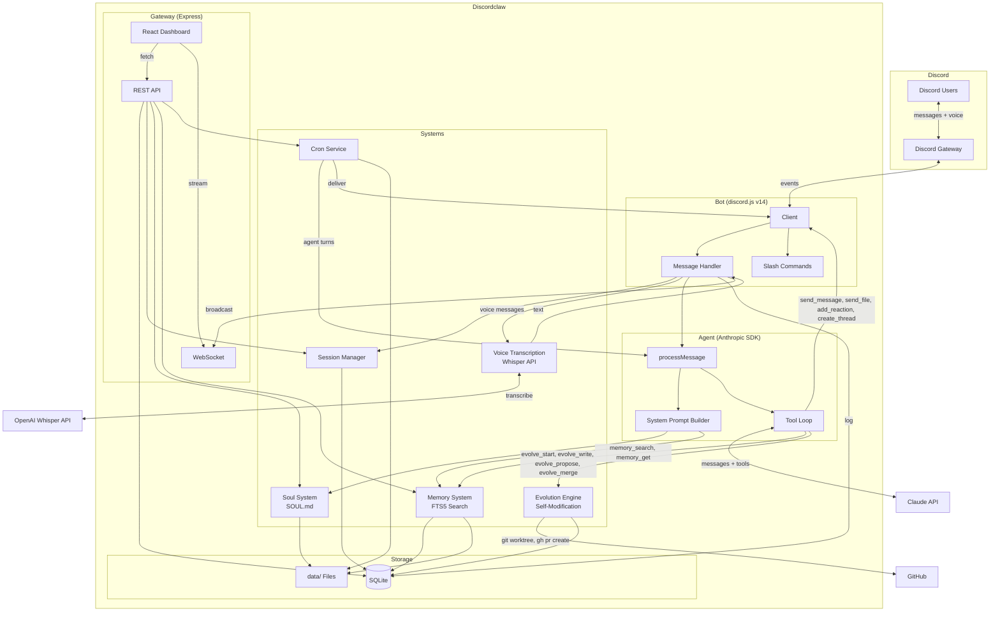
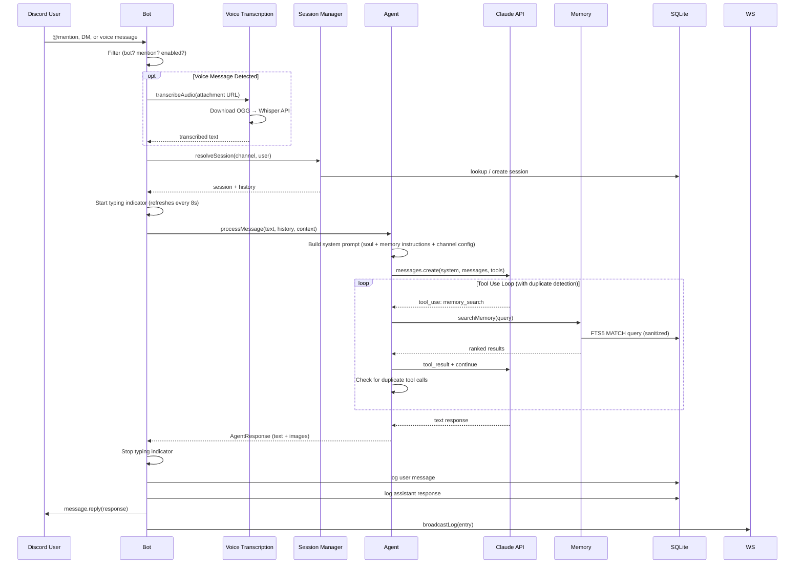
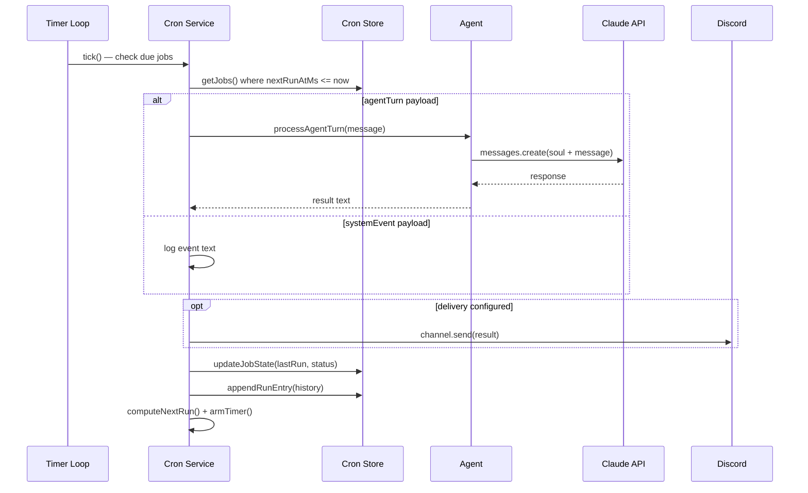
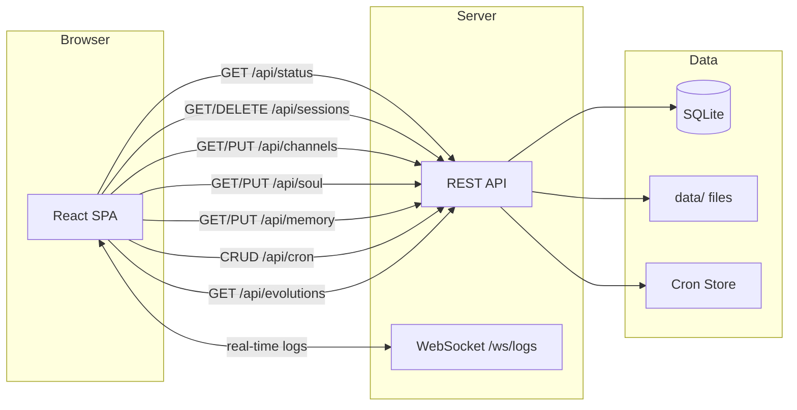
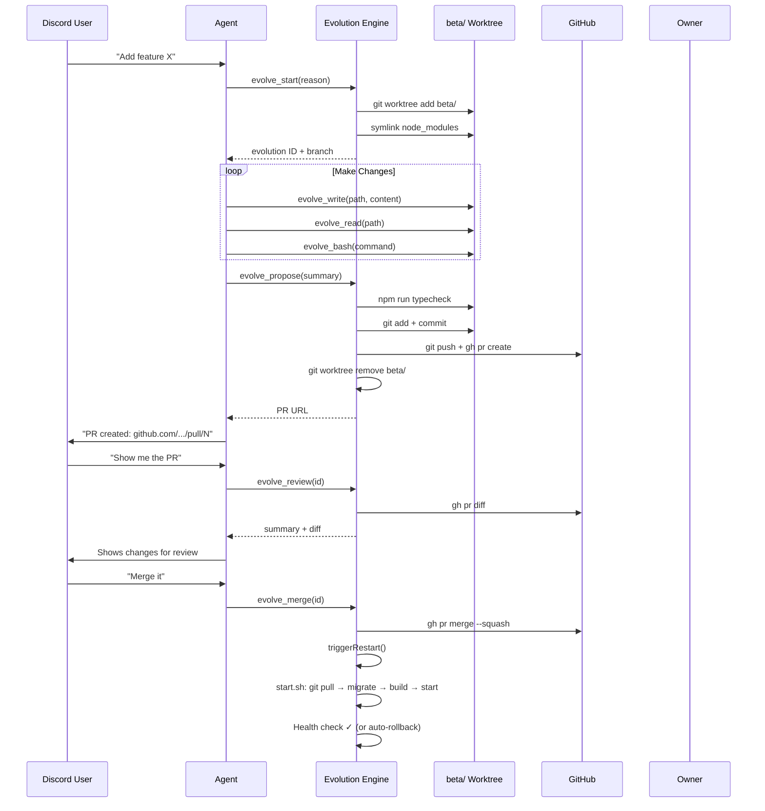

<p align="center">
  
</p>

# Discordclaw

A stripped-down Discord agent powered by Claude. Simplified fork of [openclaw](https://github.com/openclaw/openclaw) — keeps only Discord, replaces multi-provider AI with Anthropic SDK, adds a web dashboard.

## Features

- 💬 **Conversational AI** — @mention in channels or DM directly. Full conversation history per session.
- 🎤 **Voice Message Support** — Send voice DMs and the bot transcribes them automatically via OpenAI Whisper.
- 🧠 **Persistent Memory** — Remembers things across conversations. Markdown files indexed with FTS5 full-text search.
- 🎭 **Customizable Personality** — Edit `SOUL.md` to change how the bot behaves. Hot-reloads on save.
- 🔧 **Tool Use** — Runs shell commands, reads/writes files, sends messages across channels, reacts to messages, attaches files.
- 📦 **Skills** — Drop a `SKILL.md` folder into `data/skills/` and the bot learns new capabilities instantly. Install from GitHub or upload directly.
- ⏰ **Scheduled Tasks** — Cron jobs that run agent turns on a schedule and deliver results to channels.
- 🧬 **Self-Evolution** — The bot can modify its own source code via GitHub PRs. Review diffs and merge from Discord.
- 📊 **Web Dashboard** — React SPA for managing sessions, channels, soul, memory, cron, skills, and evolution history.
- 🔍 **Web Search** — Install the SearXNG skill for web, news, and package repository search.

## Demo User Flow

```
You: Hey @Discordclaw, what did we talk about yesterday?
Bot: [searches memory] We discussed setting up the cron job
     for daily standups. Want me to finish that?

You: Yeah, set it up for 9am every weekday in #general
Bot: [creates cron job] Done! I'll post a standup prompt
     to #general at 9am Mon-Fri. ✅

You: 🎤 [sends voice message]
Bot: [transcribes audio] I heard you say "Can you search
     for the latest Node.js release?" Let me check...
     Node.js v22.5.0 was released on April 1, 2026.

You: Can you search the web for the latest Node.js release?
Bot: [reads searxng-search skill, runs search] Node.js v22.5.0
     was released on April 1, 2026 with...

You: I want you to add a /ping command that shows latency
Bot: [evolve_start → evolve_write → evolve_propose]
     PR created: github.com/.../pull/8
     Want me to show you the diff?

You: Looks good, merge it
Bot: [evolve_merge] Merged and restarting... ✅
     /ping command is now live!
```

### Slash Commands

| Command | Description |
|---------|-------------|
| `/help` | Show all commands and capabilities |
| `/config` | Toggle bot on/off per channel, set custom instructions |
| `/sessions` | View and manage conversation sessions |
| `/clear` | Reset conversation history in current session |
| `/soul` | View or edit the bot's personality |

## Getting Started

Each instance of Discordclaw is its own bot with its own personality, memory, and evolution history. To run your own, you'll **fork the repo** and deploy from your fork. This way the self-evolution feature creates PRs against *your* repo, not the upstream one.

### Prerequisites

- **Node.js** v20+
- **Git** and **GitHub CLI** (`gh`) — required for the self-evolution engine
- A **Discord bot token** ([setup guide below](#1-create-a-discord-bot))
- An **Anthropic API key** (or a proxy endpoint)
- *(Optional)* An **OpenAI API key** for voice message transcription

### 1. Fork & Clone

1. Click **Fork** on [the repo](https://github.com/NaichuanZhang/discord-claw) to create your own copy
2. Clone your fork:

```bash
git clone https://github.com/YOUR_USERNAME/discord-claw.git
cd discord-claw
```

> **Why fork?** The evolution engine pushes branches and creates PRs via `gh`. If you clone without forking, PRs would target the original repo. Your fork gives you full control — the bot evolves *your* codebase.

### 2. Create a Discord Bot

1. Go to https://discord.com/developers/applications
2. Create a new application → **Bot** tab → copy token
3. Enable **Message Content Intent** and **Server Members Intent**
4. **OAuth2 > URL Generator** → scopes: `bot`, `applications.commands`
5. Permissions: Send Messages, Read Message History, Add Reactions, Attach Files, Use Slash Commands
6. Invite bot to your server with the generated URL

### 3. Configure Environment

```bash
cp .env.example .env
```

Edit `.env` with your tokens:

```env
DISCORD_BOT_TOKEN=your_discord_bot_token
ANTHROPIC_API_KEY=your_anthropic_api_key

# Optional
OPENAI_API_KEY=your_openai_key          # Voice message transcription
GATEWAY_PORT=3000                        # Dashboard port
GATEWAY_TOKEN=your_secret_token          # Dashboard auth token
ANTHROPIC_MODEL=claude-sonnet-4-20250514 # Model override
```

### 4. Install & Run

```bash
npm install
npm run build:ui    # Build the dashboard
npm run dev         # Start in development mode
```

The bot responds to **@mentions** in guild channels and all **DMs**. Dashboard at `http://localhost:3000`.

### 5. Production Deployment

For production, use the startup script which handles auto-pull, migrations, health checks, and rollback:

```bash
./start.sh
```

You can set up a systemd service, Docker container, or any process manager to keep it running. Point it at `start.sh` as the entry point.

> **Tip:** Set `DISCORD_WEBHOOK_URL` in `.env` to receive deploy/rollback notifications in a Discord channel.

### 6. Authenticate GitHub CLI (for Self-Evolution)

The evolution engine uses `gh` to create and merge PRs. Make sure it's authenticated:

```bash
gh auth login
```

Without this, the bot can still function normally — it just won't be able to create PRs to modify its own code.

### 7. Make It Yours

- **Personality** — Edit `data/SOUL.md` to define how your bot talks and behaves. Hot-reloads on save.
- **Skills** — Drop skill folders into `data/skills/` or install from GitHub via the dashboard.
- **Memory** — The bot builds memory over time. You can also seed `data/MEMORY.md` with initial context.

### Staying Up to Date

To pull improvements from the upstream repo into your fork:

```bash
git remote add upstream https://github.com/NaichuanZhang/discord-claw.git
git fetch upstream
git merge upstream/main
```

## Environment Variables

| Variable | Required | Description |
|----------|----------|-------------|
| `DISCORD_BOT_TOKEN` | Yes | Discord bot token |
| `ANTHROPIC_API_KEY` | Yes* | Anthropic API key |
| `ANTHROPIC_BASE_URL` | No | Proxy URL (overrides default API endpoint) |
| `ANTHROPIC_AUTH_TOKEN` | No | Auth token for proxy (used instead of API key) |
| `ANTHROPIC_MODEL` | No | Model name (default: `bedrock-claude-opus-4-6-1m`) |
| `OPENAI_API_KEY` | No | OpenAI API key for voice message transcription (Whisper) |
| `GATEWAY_PORT` | No | Dashboard port (default: `3000`) |
| `SESSION_TTL_HOURS` | No | Session expiry (default: `24`) |
| `DISCORD_WEBHOOK_URL` | No | Webhook for `start.sh` notifications (deploy, rollback alerts) |

*Either `ANTHROPIC_API_KEY` or `ANTHROPIC_BASE_URL` + `ANTHROPIC_AUTH_TOKEN` required.

## Key Systems

**Soul** — Bot personality defined in `data/SOUL.md`. Hot-reloads on file change. Editable via dashboard.

**Memory** — Markdown files in `data/` indexed with SQLite FTS5. The agent searches memory before answering questions about past context. BM25 ranked results. Queries are sanitized for FTS5 compatibility (special characters like hyphens and colons are handled automatically).

**Sessions** — Per-thread/DM/channel conversation tracking. History loaded as context for each message. Auto-expires after TTL.

**Cron** — Scheduled tasks with three schedule types: one-shot (`at`), interval (`every`), cron expression (`cron`). Jobs can run agent turns and deliver results to Discord channels. Auto-disables after 3 consecutive failures.

**Skills** — Modular capabilities defined as SKILL.md files with YAML frontmatter. Install from GitHub URL or upload directly. Uses SDK progressive loading pattern: only skill metadata (name, description, path) is injected into the system prompt; the agent reads full skill content on demand via `read_skill` tool. Skills can include companion files (scripts, references). Manageable via dashboard.

**Dashboard** — Single-page React app at `http://localhost:3000`. Status, session browser, channel config, soul/memory editor, cron manager, skills manager, evolution history, real-time message logs via WebSocket.

**Agent Loop** — The tool-use loop runs until the model produces a final text response. To prevent infinite loops, consecutive duplicate tool calls (same tool + same arguments) are detected — after 2 identical rounds the agent is forced to produce a final response. Typing indicator refreshes every 8 seconds to stay visible during long tool chains.

**File Attachments** — The agent can send files (PDFs, images, HTML, etc.) to Discord channels via the `send_file` tool. Files up to 25 MB are supported (Discord bot default tier).

**Image Support** — When the agent's response contains markdown images (``), they are automatically extracted and rendered as Discord embeds (for web URLs) or file attachments (for local files). Image markdown is stripped from the text to avoid showing raw URLs.

**Voice Messages** — Discord voice DMs and audio attachments are automatically detected and transcribed using OpenAI's Whisper API. The transcribed text is passed to the agent as the message content. Requires `OPENAI_API_KEY`. Gracefully degrades with a helpful message if the API key isn't configured. Supports OGG, MP3, WAV, M4A, WebM, FLAC, and other common audio formats.

**Evolution Engine** — The bot can modify its own source code through GitHub pull requests. All changes are isolated in a git worktree at `beta/`, typechecked, and submitted as PRs via `gh` CLI. The agent has 9 evolution tools: `evolve_start`, `evolve_read`, `evolve_write`, `evolve_bash`, `evolve_propose`, `evolve_suggest`, `evolve_cancel`, `evolve_review`, and `evolve_merge`. Users can review PR diffs and merge directly from Discord — merging automatically triggers a restart to deploy the changes. The bot also records ideas for improvements it can't yet make (`evolve_suggest`). Evolution history is tracked in SQLite and viewable in the dashboard. An idempotent startup script (`start.sh`) handles deploy: `git pull` → run migrations → build → start → health check → auto-rollback on failure.

**Restart** — The bot can restart itself via slash command or automatically after merging an evolution PR. On restart, stale instances are automatically detected and killed to prevent duplicate bots.

## Architecture



## Data Flow

### Message Flow



### Cron Job Execution



### Dashboard Data Flow



### Evolution Flow



## Project Structure

```
discordclaw/
├── src/
│   ├── index.ts              # Entry point: start all systems, kill stale instances on restart
│   ├── restart.ts            # Shared restart trigger — avoids circular deps
│   ├── bot/                   # Discord bot (discord.js v14)
│   │   ├── client.ts          # Client setup, intents, event routing, DM raw fallback
│   │   ├── messages.ts        # Message pipeline: filter → session → voice transcribe → agent → reply
│   │   ├── commands.ts        # Slash commands: /help /config /sessions /clear /soul
│   │   └── components.ts      # Button/select interaction handler
│   ├── agent/                 # Claude integration
│   │   ├── agent.ts           # Anthropic SDK wrapper, system prompt, tool loop + duplicate detection
│   │   ├── tools.ts           # Discord tools (send_message, send_file, add_reaction, get_history, create_thread)
│   │   ├── dangerous-tools.ts # Powerful tools: bash, read_file, write_file
│   │   └── sessions.ts        # Per-thread/DM session tracking + TTL
│   ├── audio/                 # Voice message handling
│   │   └── transcribe.ts      # Download + transcribe via OpenAI Whisper API
│   ├── skills/                # Skills management (SDK pattern)
│   │   ├── types.ts           # Skill, SkillMeta, SkillSource types
│   │   ├── store.ts           # Filesystem-based discovery + per-skill .meta.json
│   │   ├── service.ts         # CRUD, GitHub install, prompt generation, file watcher
│   │   └── tools.ts           # read_skill + list_skill_files tool definitions
│   ├── soul/
│   │   └── soul.ts            # Load SOUL.md, file watcher, hot-reload
│   ├── memory/
│   │   ├── memory.ts          # File discovery, FTS5 indexing, BM25 search, query sanitization
│   │   └── tools.ts           # memory_search + memory_get tool definitions
│   ├── cron/
│   │   ├── types.ts           # Job, schedule, payload, delivery types
│   │   ├── store.ts           # JSON persistence + JSONL run history
│   │   └── service.ts         # Timer loop, execution, retry, auto-disable
│   ├── evolution/             # Self-evolution system
│   │   ├── engine.ts          # Git worktree lifecycle, PR creation via gh CLI
│   │   ├── log.ts             # Evolution SQLite table + CRUD
│   │   ├── tools.ts           # Agent tools: evolve_start/read/write/bash/propose/suggest/cancel/review/merge
│   │   └── health.ts          # /api/health endpoint for start.sh
│   ├── db/
│   │   └── index.ts           # SQLite schema, migrations, query helpers
│   └── gateway/
│       ├── server.ts          # Express + WebSocket server
│       ├── api.ts             # REST API (status, sessions, channels, config, soul, memory, cron, skills, evolutions)
│       └── ui/                # React SPA (Vite)
│           ├── App.tsx         # Layout, routing, shared styles
│           └── pages/          # Status, Sessions, Channels, Config, Cron, Skills, Evolution, Logs
├── data/                      # Runtime data (gitignored)
│   ├── discordclaw.db         # SQLite database
│   ├── SOUL.md                # Bot personality
│   ├── MEMORY.md              # Long-term memory
│   ├── memory/                # Daily memory notes
│   ├── cron/                  # Job store + run history
│   ├── skills/                # Installed skills (SKILL.md + companion files)
│   └── .migrations/           # Marker files for completed migrations
├── migrations/                # Idempotent migration scripts (run by start.sh)
├── start.sh                   # Production startup: pull → migrate → build → start → health check
├── .env                       # DISCORD_BOT_TOKEN, ANTHROPIC_* config, OPENAI_API_KEY
├── package.json
├── tsconfig.json
└── vite.config.ts
```
