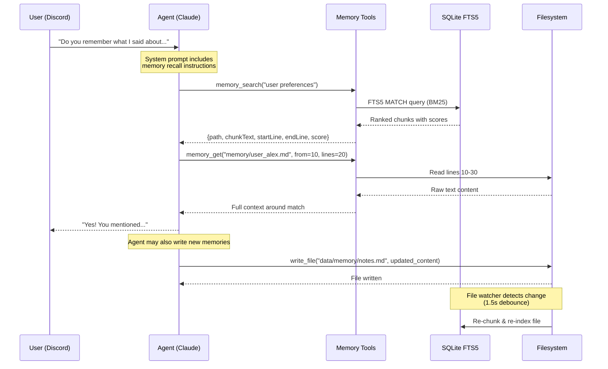
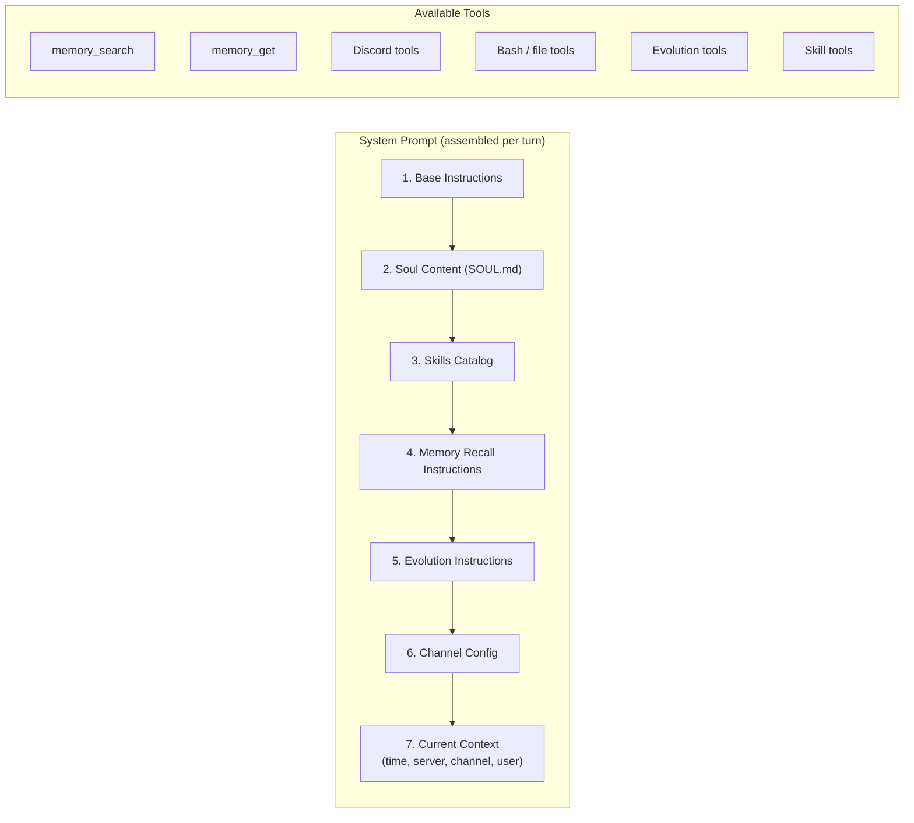

# Discordclaw Memory System — Architecture Documentation

> Generated: April 18, 2026

## Overview

The Discordclaw memory system provides **persistent, searchable long-term memory** for the AI agent. It combines **Markdown files on disk** with **SQLite FTS5 full-text search** to give the agent fast, relevant recall of facts, preferences, user profiles, and past decisions.

---

## Core Components

### 1. Memory Files (Source of Truth)

All memory is stored as **Markdown files** in two locations:

| Location | Purpose |
|---|---|
| `data/MEMORY.md` | Root-level memory file (general facts) |
| `data/memory/*.md` | Topic-specific memory files |

**Current memory files (11 files, 607 lines total):**

| File | Lines | Content |
|---|---|---|
| `user_alex.md` | 63 | User profile, preferences, context |
| `alex_training_log.md` | 65 | Fitness/training history |
| `channel_purposes.md` | 20 | What each Discord channel is for |
| `food_log.md` | 14 | Diet/nutrition tracking |
| `market_predictions.md` | 243 | Market analysis & predictions |
| `news-sources.md` | 9 | Trusted news/data sources |
| `notes.md` | 54 | General notes & facts |
| `reflection_log.md` | 61 | Self-improvement reflections |
| `self_reflections.md` | 30 | Introspective observations |
| `voice-pipeline-optimization.md` | 40 | Technical notes on voice system |
| `workout_log.md` | 8 | Exercise tracking |

### 2. FTS5 Index (Search Engine)

Memory files are chunked and indexed into an **SQLite FTS5 virtual table** for BM25-ranked full-text search.

```sql
CREATE VIRTUAL TABLE memory_fts USING fts5(
  path,           -- relative path from data/
  chunk_text,     -- the chunk content
  start_line,     -- UNINDEXED, for line-level retrieval
  end_line        -- UNINDEXED, for line-level retrieval
);
```

### 3. Chunking Engine

Files are split into overlapping chunks for granular search:

- **Chunk size:** ~1,600 characters (~400 tokens)
- **Overlap:** ~320 characters (~80 tokens)
- **Break strategy:** Prefers paragraph boundaries (`\n\n`)
- Tracks line numbers per chunk for precise retrieval

### 4. File Watcher (Live Re-indexing)

A `fs.watch` watcher monitors the `data/` directory recursively:

- Only triggers on `.md` file changes
- **1,500ms debounce** to batch rapid edits
- Uses **mtime cache** to skip unchanged files
- Automatically removes index entries for deleted files

### 5. Soul System (`data/SOUL.md`)

The Soul is a **personality/behavior configuration** file:

- Loaded at boot, injected into every system prompt
- Live-reloaded on file change (500ms debounce)
- Defines tone, behavior, identity
- Separate from memory — soul = *who I am*, memory = *what I know*

### 6. Signals & Reflection (Self-Improvement Layer)

The **signals system** captures operational events for periodic self-analysis:

| Signal Type | What It Captures |
|---|---|
| `error` | Uncaught errors, crashes |
| `tool_failure` | Tool calls that returned errors |
| `user_sentiment` | Positive/negative user reactions |
| `unknown_request` | Things users asked that the agent couldn't do |
| `pattern` | Repeated behavioral patterns worth noting |

Signals are stored in SQLite and consumed by the **Reflection Daemon** (runs every 6 hours) which analyzes patterns and suggests improvements.

---

## Data Flow

```mermaid
flowchart TB
    subgraph WRITE["✏️ Write Path"]
        direction TB
        A1["Agent (write_file tool)"] -->|Creates/updates| MD["Markdown Files\ndata/memory/*.md\ndata/MEMORY.md"]
        A2["Cron Jobs"] -->|Append data| MD
        A3["User Requests"] -->|"'Remember this...'"| A1
    end

    subgraph INDEX["🔍 Indexing Pipeline"]
        direction TB
        MD -->|fs.watch trigger| FW["File Watcher\n(1.5s debounce)"]
        FW -->|mtime check| CHUNK["Chunker\n~1600 chars / ~400 tokens\n320 char overlap"]
        CHUNK -->|INSERT| FTS["SQLite FTS5\nmemory_fts table\n(BM25 ranking)"]
    end

    subgraph BOOT["🚀 Boot Sequence"]
        direction LR
        B1["initMemory()"] -->|Scan all .md files| FTS
        B2["initSoul()"] -->|Load SOUL.md| SOUL["Soul Content\n(in-memory string)"]
    end

    subgraph READ["📖 Read Path (Agent Turn)"]
        direction TB
        SYS["System Prompt Builder"] -->|Injects| SOUL
        SYS -->|Injects| INST["Memory Recall\nInstructions"]
        
        QUERY["memory_search tool\n(from LLM tool_use)"] -->|FTS5 MATCH\nBM25 ranked| FTS
        FTS -->|Top N results\n(path, chunk, lines, score)| RESULTS["Search Results"]
        
        GETLINES["memory_get tool"] -->|Read specific lines\nfrom disk| MD
    end

    subgraph REFLECT["🧠 Reflection Loop"]
        direction TB
        CONV["Conversations"] -->|Emit| SIG["Signals Table\n(errors, failures,\nsentiment, patterns)"]
        SIG -->|Every 6 hours| REF["Reflection Daemon\n(Claude analysis)"]
        REF -->|Records| IDEAS["Evolution Ideas\n(evolve_suggest)"]
        SIG -->|7-day retention| PRUNE["Auto-Prune"]
    end

    style WRITE fill:#2d5a3d,stroke:#4ade80,color:#fff
    style INDEX fill:#4a3d5a,stroke:#a78bfa,color:#fff
    style READ fill:#3d4a5a,stroke:#60a5fa,color:#fff
    style REFLECT fill:#5a4a3d,stroke:#fbbf24,color:#fff
    style BOOT fill:#3d3d5a,stroke:#818cf8,color:#fff
```

---

## Agent Interaction Flow



---

## System Prompt Assembly

The memory system integrates into every agent turn via the system prompt:



---

## Key Design Decisions

| Decision | Rationale |
|---|---|
| **Markdown files as source of truth** | Human-readable, git-trackable, easy to edit manually |
| **FTS5 over vector embeddings** | Zero external dependencies, fast BM25 search, no embedding API costs |
| **Overlapping chunks** | Prevents context from being split across chunk boundaries |
| **Paragraph-aware chunking** | Respects logical content boundaries |
| **File watcher with debounce** | Live re-indexing without polling overhead |
| **Mtime cache** | Avoids re-indexing unchanged files on startup |
| **Path traversal protection** | `memory_get` validates paths stay within `data/` |
| **Separate soul vs memory** | Identity (soul) is stable; knowledge (memory) grows organically |

---

## File Locations

```
data/
├── MEMORY.md                  # Root memory file
├── SOUL.md                    # Personality/behavior config
├── discordclaw.db             # SQLite DB (FTS5 index, signals, sessions)
└── memory/                    # Topic-specific memory files
    ├── alex_training_log.md
    ├── channel_purposes.md
    ├── food_log.md
    ├── market_predictions.md
    ├── news-sources.md
    ├── notes.md
    ├── reflection_log.md
    ├── self_reflections.md
    ├── user_alex.md
    ├── voice-pipeline-optimization.md
    └── workout_log.md

src/
├── memory/
│   ├── memory.ts              # Chunking, indexing, search, file watcher
│   └── tools.ts               # Tool definitions & handler
├── soul/
│   └── soul.ts                # Soul loader & watcher
├── reflection/
│   ├── signals.ts             # Signal collection & querying
│   └── reflection.ts          # Periodic self-analysis daemon
├── db/
│   └── index.ts               # SQLite schema (FTS5 table definition)
└── agent/
    └── agent.ts               # System prompt assembly, tool dispatch
```
